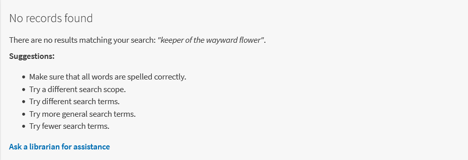

# primo-explore-custom-no-results
Add custom text when no records retrieved. (Original code includes link to expand results to PCI, which has been removed for this version.)

The OTB page in the Primo NUI for a no results search looks like this:


The custom js in this package allows you to adjust the text and other links you provide when a user isn't successful in their search.  The js has been altered using the Ex Libris tool for bringing custom js into compliance with Angular 1.8, as linked from the [upgrade announcement](https://knowledge.exlibrisgroup.com/Primo/Product_Materials/Announcements/Preparing_for_the_Upgrade_to_Angular_1.8_in_Primo%2F%2FPrimo_VE).

Here's how this version looks: 



If you use the HTML as given in the Angular component, you'll want to suppress the OTB tile in the CSS:

```css
prm-no-search-result > md-card {
    display:none;
}
```
If you ONLY want to add link(s) to the pre-existing text, you can do so by removing the search suggestion section from the js. Your additions will display below the OTB tile.
